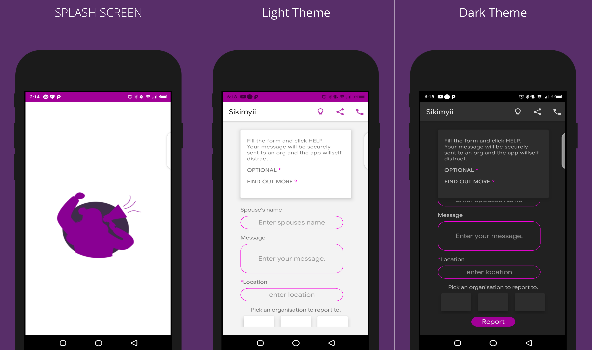

# WhisBlower(Sikimyii)

## About
 An app for domestic violence victims to easily get help from the responsible organisations incase of danger.

## Built With 🛠
- [Kotlin](https://kotlinlang.org/) - First class and official programming language for Android development.
- [ViewBinding](https://developer.android.com/topic/libraries/view-binding) - Generates a binding class for each XML layout file present in that module and allows you to more easily write code that interacts with views.
- [In-app Updates](https://developer.android.com/guide/playcore/in-app-updates) - Lets the app download updates seemlessly with out interrupting the user experince with the app.

## TODO
- Add the organisations functionality once we are partnered up.
- Use DI to handle dependecies and make the app very scalable and testable.
- Add in-app updates to the app.
- etc...

## Contact
If you need any help, you can connect with me.

Visit:- [maku](https://www.linkedin.com/in/maku-mazakpe-700a3a165/)

## License
```
MIT License

Copyright (c) 2020 Maku Pauline Mazakpe

Permission is hereby granted, free of charge, to any person obtaining a copy
of this software and associated documentation files (the "Software"), to deal
in the Software without restriction, including without limitation the rights
to use, copy, modify, merge, publish, distribute, sublicense, and/or sell
copies of the Software, and to permit persons to whom the Software is
furnished to do so, subject to the following conditions:

The above copyright notice and this permission notice shall be included in all
copies or substantial portions of the Software.

THE SOFTWARE IS PROVIDED "AS IS", WITHOUT WARRANTY OF ANY KIND, EXPRESS OR
IMPLIED, INCLUDING BUT NOT LIMITED TO THE WARRANTIES OF MERCHANTABILITY,
FITNESS FOR A PARTICULAR PURPOSE AND NONINFRINGEMENT. IN NO EVENT SHALL THE
AUTHORS OR COPYRIGHT HOLDERS BE LIABLE FOR ANY CLAIM, DAMAGES OR OTHER
LIABILITY, WHETHER IN AN ACTION OF CONTRACT, TORT OR OTHERWISE, ARISING FROM,
OUT OF OR IN CONNECTION WITH THE SOFTWARE OR THE USE OR OTHER DEALINGS IN THE
SOFTWARE.
```